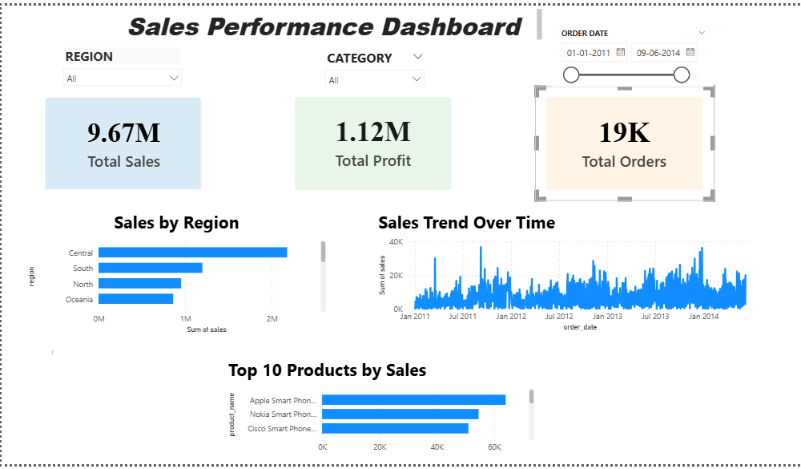

# Sales Dashboard (Power BI)

## About
I created this project to analyze sales data using Power BI. The goal was to understand sales, profit, and product performance in a simple and clear way.

## What I did
- Cleaned the dataset using Power Query
- Fixed data types and handled missing values
- Created columns like profit margin, year, and month
- Built an interactive dashboard

## Dashboard Preview

## Key Insights
- West region had highest sales performance  
- Technology category generated highest profit  
- Sales trend shows peak during specific months  

## Dashboard Features
- Total Sales, Total Profit, Total Orders (Card visuals)
- Sales trend over time
- Sales by region
- Top 10 products
- Filters for Region, Category, and Date

## Files
- Sales_Dashboard.pbix
- Superstore.csv
- dashboard.png

## How to use
Open the `Sales_Dashboard.pbix` file in Power BI Desktop to view and explore the dashboard.

## Note
This project helped me understand data cleaning, visualization, and how to build a simple dashboard that gives useful business insights.
